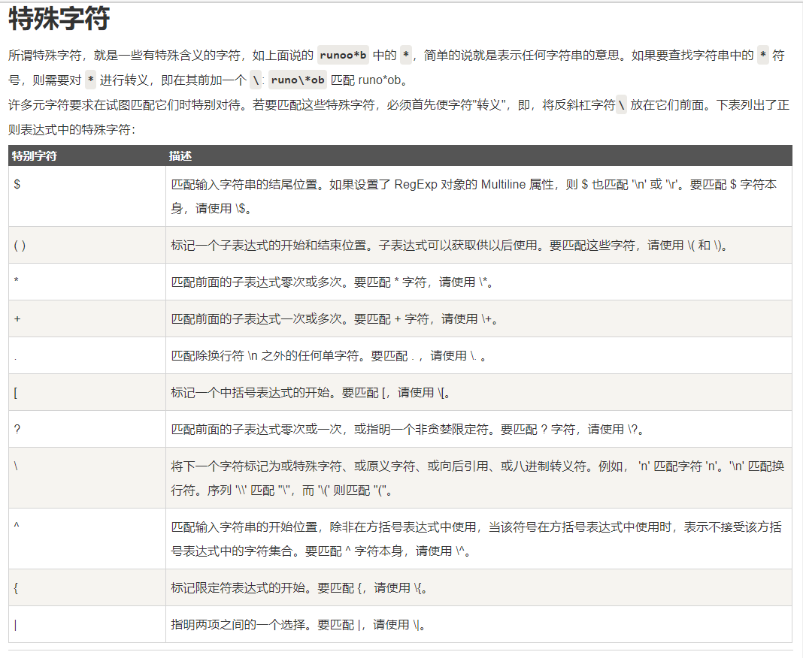

  2020年06月19日 18时
  


----------

 - '+' :作用是作为连续字符的伸缩性匹配，runoo+b，可以匹配 runoob、runooob、runoooooob 等，+ 号代表前面的字符必须至少出现一次(1次或多次)
 - '\*':作用同上 但是\*号匹配的连续字符是可以不出现的，runoo\*b，可以匹配 runob、runoob、runoooooob 等，\*号代表字符可以不出现，也可以出现一次或者多次(0次、或1次、或多次)。
 - colou?r 可以匹配 color 或者 colour，? 问号代表前面的字符最多只可以出现一次（0次、或1次）。
   

``` javascript
const regex = /no+t/gm;  //匹配 not noot nooot等
const regex = /no*t/gm;  //匹配 nt not noot nooot等
const regex = /colou?r/gm; //匹配color ,colour ；？代表前面的限定字符只能出现一次或不出现
```
字符	描述
\cx	匹配由x指明的控制字符。例如， \cM 匹配一个 Control-M 或回车符。x 的值必须为 A-Z 或 a-z 之一。否则，将 c 视为一个原义的 'c' 字符。
\f	匹配一个换页符。等价于 \x0c 和 \cL。
\n	匹配一个换行符。等价于 \x0a 和 \cJ。
\r	匹配一个回车符。等价于 \x0d 和 \cM。
\s	匹配任何空白字符，包括空格、制表符、换页符等等。等价于 [ \f\n\r\t\v]。注意 Unicode 正则表达式会匹配全角空格符。
\S	匹配任何非空白字符。等价于 [^ \f\n\r\t\v]。
\t	匹配一个制表符。等价于 \x09 和 \cI。
\v	匹配一个垂直制表符。等价于 \x0b 和 \cK。





以下正则表达式匹配一个正整数，[1-9]设置第一个数字不是 0，[0-9]* 表示任意多个数字：

``` markdown
/[1-9][0-9]*/
```


请注意，限定符出现在范围表达式之后。因此，它应用于整个范围表达式，在本例中，只指定从 0 到 9 的数字（包括 0 和 9）。

这里不使用 + 限定符，因为在第二个位置或后面的位置不一定需要有一个数字。也不使用 ? 字符，因为使用 ? 会将整数限制到只有两位数。

如果你想设置 0~99 的两位数，可以使用下面的表达式来至少指定一位但至多两位数字。

``` lsl
/[0-9]{1,2}/
```

上面的表达式的缺点是，只能匹配两位数字，而且可以匹配 0、00、01、10 99 的章节编号仍只匹配开头两位数字。

**改进下**，匹配 1~99 的正整数表达式如下：

``` markdown
/[1-9][0-9]?/
```

或

``` markdown
/[1-9][0-9]{0,1}/
```

\* 和 + 限定符都是贪婪的，因为它们会尽可能多的匹配文字，只有在它们的后面加上一个 ? 就可以实现非贪婪或最小匹配。

例如，您可能搜索 HTML 文档，以查找在 h1 标签内的内容。HTML 代码如下：

# RUNOOB-菜鸟教程
贪婪：下面的表达式匹配从开始小于符号 (<) 到关闭 h1 标记的大于符号 (>) 之间的所有内容。
``` xml
/<.*>/
```
非贪婪：如果您只需要匹配开始和结束 h1 标签，下面的非贪婪表达式只匹配
h1标签。
``` xml
/<.*?>/
```
也可以使用以下正则表达式来匹配 h1 标签，表达式则是：
``` xml
/<\w+?>/
```
通过在 \*、+ 或 ? 限定符之后放置 ?，该表达式从"贪婪"表达式转换为"非贪婪"表达式或者最小匹配。