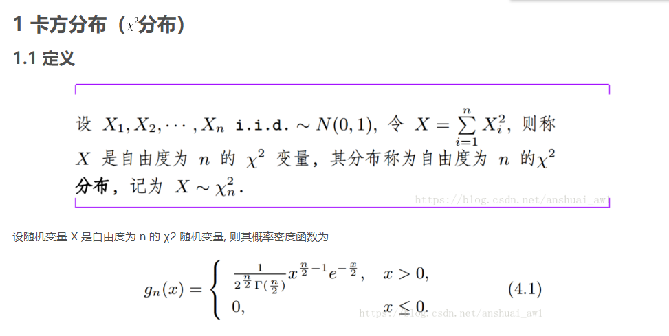
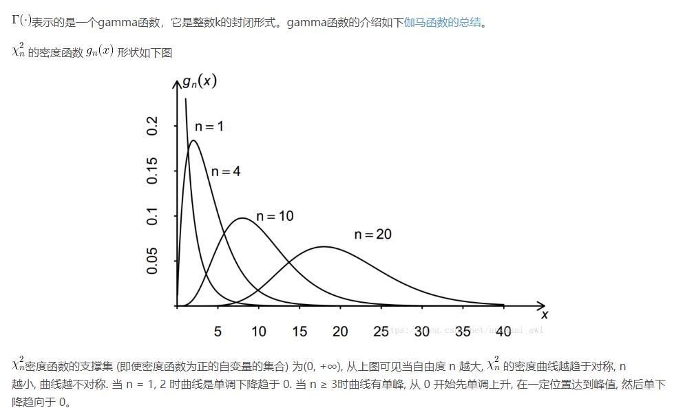
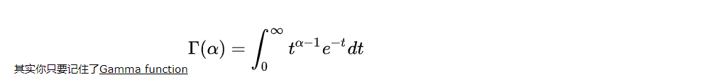

## 背景
写这篇文章，不，应该说笔记的背景在于我在急迫的想要完成仿真的时间节点上，迟迟无法下手，内心十分急躁，所以我觉得我有必要冷静下来，拜托百度等快节奏应用带给我的急躁感来大致梳理一下自己的仿真思路。

----------
## 模型过程
在整个模型中，我需要主要进行的有两个大步骤，一个是建立模型，一个是分析参数并且完成仿真。这两部分都不算很难，但是我因为一直以来的浮躁心理迟迟没有完成。其实模型建立的部分已经基本完成，只剩下仿真验证了，仿真验证需要我对信道进行建模，模型已经确定是瑞利分布的方式，及H是服从瑞利分布的，至于H的由来，就不过多陈述了。

 - |H|^2是我在模拟过程中主要需要用到的，他应该是满足指数分布的。
 - H是两个标准正态分布的平方和又开方；
 - 如果是两个标准正态随机变量的平方和则是服从两个自由度的卡方分布。
   

----------

由上面的三张图片我们可以得到，当n=2时 \gamma(n/2)=1;故此时卡方分布的表达式为指数分布的表达式：
