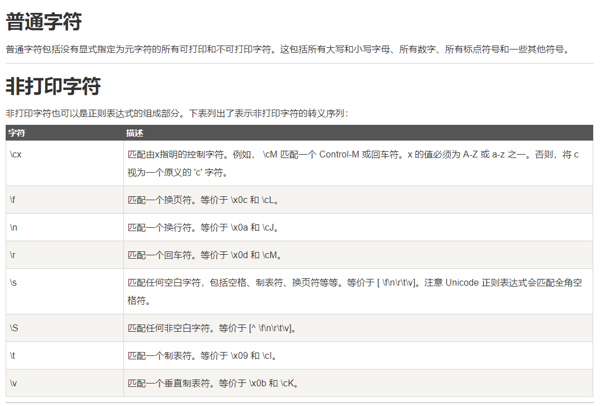

  2020年06月19日 18时
  


----------

 - '+' :作用是作为连续字符的伸缩性匹配，runoo+b，可以匹配 runoob、runooob、runoooooob 等，+ 号代表前面的字符必须至少出现一次(1次或多次)
 - '\*':作用同上 但是\*号匹配的连续字符是可以不出现的，runoo\*b，可以匹配 runob、runoob、runoooooob 等，\*号代表字符可以不出现，也可以出现一次或者多次(0次、或1次、或多次)。
 - colou?r 可以匹配 color 或者 colour，? 问号代表前面的字符最多只可以出现一次（0次、或1次）。
   

``` javascript
const regex = /no+t/gm;  //匹配 not noot nooot等
const regex = /no*t/gm;  //匹配 nt not noot nooot等
const regex = /colou?r/gm; //匹配color ,colour ；？代表前面的限定字符只能出现一次或不出现
```
字符	描述
\cx	匹配由x指明的控制字符。例如， \cM 匹配一个 Control-M 或回车符。x 的值必须为 A-Z 或 a-z 之一。否则，将 c 视为一个原义的 'c' 字符。
\f	匹配一个换页符。等价于 \x0c 和 \cL。
\n	匹配一个换行符。等价于 \x0a 和 \cJ。
\r	匹配一个回车符。等价于 \x0d 和 \cM。
\s	匹配任何空白字符，包括空格、制表符、换页符等等。等价于 [ \f\n\r\t\v]。注意 Unicode 正则表达式会匹配全角空格符。
\S	匹配任何非空白字符。等价于 [^ \f\n\r\t\v]。
\t	匹配一个制表符。等价于 \x09 和 \cI。
\v	匹配一个垂直制表符。等价于 \x0b 和 \cK。

